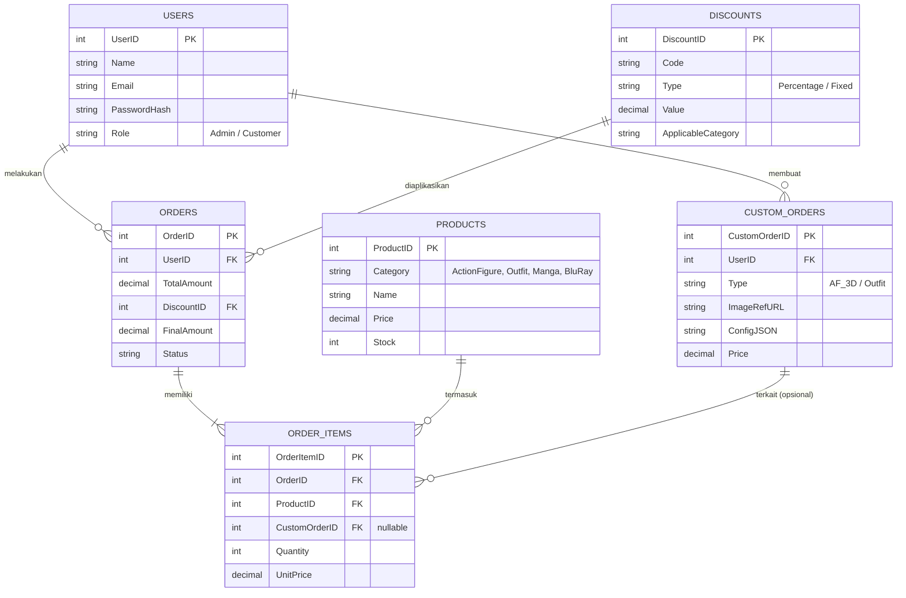
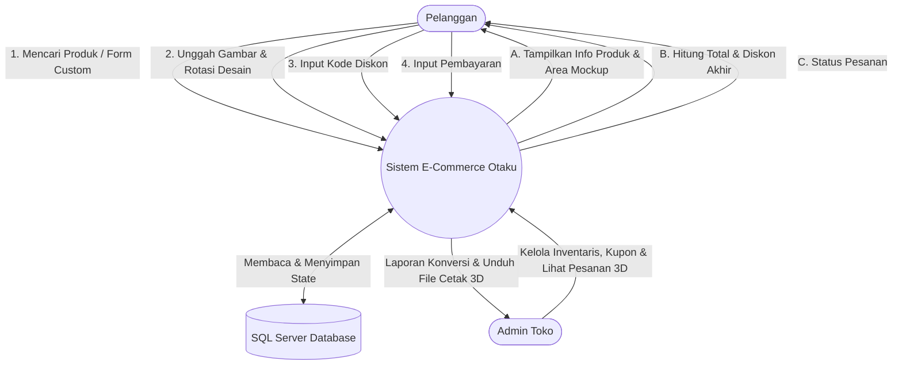
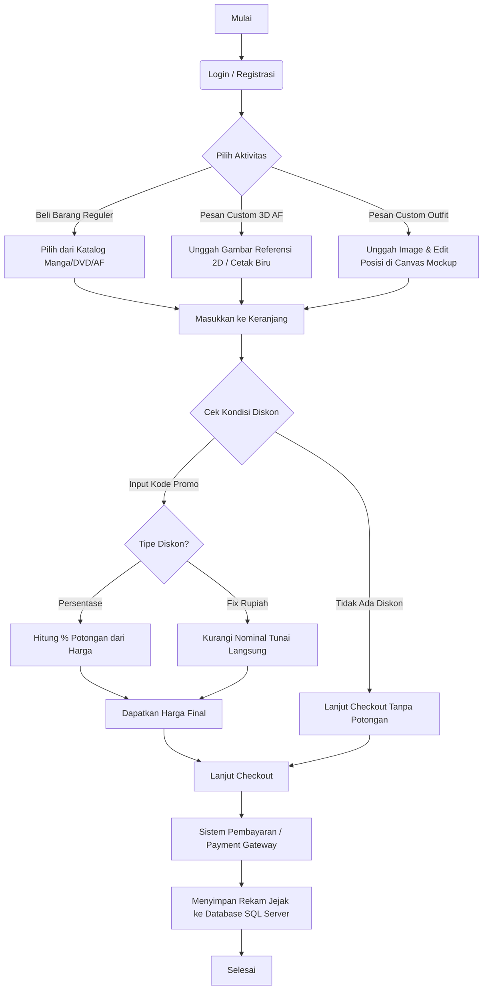

# Arsitektur Database & Diagram Sistem (SQL Server)

Dokumen ini berisi pemodelan data dan alur sistem untuk aplikasi web E-commerce Otaku Store, mencakup fitur reguler dan modul kustomisasi (3D AF & Outfit).

## 1. Entity Relationship Diagram (ERD)
ERD ini memetakan relasi antar entitas utama di dalam database pangkalan data SQL Server. Skema melibatkan pemecahan tipe pemesanan antara barang reguler (`Products`) dan layanan berbasis lampiran (*file image*) yang di-submit user (`CustomOrders`). Kupon (`Discounts`) terhubung ke tabel `Orders` untuk merangkum total pesanan.

## 2. Data Flow Diagram (DFD) - Level 0 (Context Diagram)

DFD yang menunjukkan pertukaran informasi utama di sekitar aplikasi.

## 3. Flowchart Pembelian (User Journey menuju Kalkulasi Checkout)

Flowchart sistem E-commerce dari saat pelanggan login hingga checkout beserta fungsionalitas cabang diskon (Reguler VS Servis Custom).

